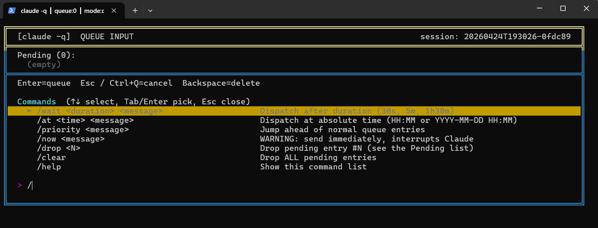

# claude-q

> Type-ahead FIFO queue wrapper for Claude Code CLI on Windows.
> Press `Ctrl+Q` mid-response to queue a follow-up question without
> interrupting Claude's current work — it's auto-dispatched when Claude
> returns to idle.


---

## The problem

You're chatting with `claude` in the terminal. Claude is writing a long
answer and you suddenly remember a follow-up question. In native Claude
Code:

* Pressing Enter while Claude is streaming **may interrupt** the current
  answer (behaviour varies between versions — see
  [anthropics/claude-code#50246](https://github.com/anthropics/claude-code/issues/50246),
  [#34835](https://github.com/anthropics/claude-code/issues/34835),
  [#33323](https://github.com/anthropics/claude-code/issues/33323)).
* Claude Code v2.1.x does ship a native queue, but its UI still mixes the
  queued text into the active response area, causing visual confusion and
  occasional loss.

`claude-q` solves this by wrapping Claude in a PTY and exposing a second,
completely isolated queue channel. Pressing `Ctrl+Q` pops up a dedicated
full-screen queue UI (via the terminal's alt-screen buffer — like vim or
less); you type the follow-up, hit Enter, and the UI disappears restoring
Claude's view exactly as it was. The queued message is auto-sent the
moment Claude's prompt becomes empty again.

---

## What it looks like

The alt-screen queue UI with the slash-command dropdown open (type
`/` while in queue mode to filter; `↑↓` navigate, `Tab` / `Enter`
picks a template, `Esc` closes):



When you hit Enter the UI vanishes and Claude's view comes back
untouched. The queued message is dispatched the moment Claude's
prompt is empty again.

> 📸 More shots welcome — see
> [`docs/screenshots/README.md`](./docs/screenshots/README.md) for the
> ones we'd still like to collect (`dropdown.png`, `direct-mode.png`,
> `error-handling.png`).

---

## Quick start

### Requirements

* Windows 10 1809+ (for ConPTY)
* Python 3.10+
* [Claude Code CLI](https://github.com/anthropics/claude-code) installed
  and on your `PATH`

### Install

Clone into `~/.claude/scripts/` (recommended) or anywhere you like:

```powershell
git clone https://github.com/yian524/claude-queue.git "$env:USERPROFILE\.claude\scripts\claude-queue"
cd "$env:USERPROFILE\.claude\scripts\claude-queue"
python -m venv .venv
.venv\Scripts\python.exe -m pip install pywinpty prompt_toolkit pytest
```

Make the `claude -q ...` syntax work in your PowerShell sessions by
adding a function to your PowerShell `$PROFILE`:

```powershell
# Create PROFILE file if it doesn't exist yet
New-Item -Path $PROFILE -ItemType File -Force

# Append the claude wrapper function (this repo ships a ready-made one)
Get-Content "$env:USERPROFILE\.claude\scripts\claude-queue\bin\claude-profile.ps1" |
  Add-Content -Path $PROFILE
```

This works because **PowerShell functions take priority over anything
on `$PATH`**, so the function unconditionally catches every `claude ...`
invocation and decides whether to route to the wrapper (`-q`) or to the
real `claude.exe` (anything else).

For `cmd.exe` users or if you prefer a directory-based shim, the repo
also ships `bin/claude.cmd` and `bin/claude-q.cmd`. Place them in a
directory that appears on your `PATH` **before** the real
`claude.exe`'s directory. (On PowerShell the function profile route is
more reliable because PATHEXT preference quirks can cause `.exe` to
win over `.cmd` even when the `.cmd`'s directory is listed first.)

### Verify

```powershell
claude -q doctor
```

All eight checks should report `OK`.

### Run

```powershell
claude -q
```

Claude Code launches as usual. The difference: press `Ctrl+Q` mid-response
to drop into the queue UI.

> **Tip:** every other `claude <subcommand>` still works unchanged — the
> shim only intercepts when the first argument is `-q`. So `claude
> --version`, `claude --resume ...`, `/mcp`, etc. all behave normally.

> **Backward-compat:** the older `claude-q` / `claude-q-add` commands
> still exist as aliases if you already had scripts or muscle memory
> using them.

---

## Keyboard cheatsheet

| In direct mode ( `❯` prompt) | Effect |
|---|---|
| Any key | Forwarded to Claude unchanged |
| `Ctrl+Q` | **Switch to queue mode** (opens alt-screen UI) |
| `Ctrl+C` | Forwarded — let Claude interrupt itself |

| In queue mode (alt-screen UI) | Effect |
|---|---|
| Printable keys / IME | Insert at cursor position |
| `Backspace` | Delete char before cursor |
| `Delete` | Delete char at cursor |
| `←` / `→` | Move cursor one char (handles CJK 2-column width) |
| `Home` / `End` | Jump to start / end of input |
| `Ctrl+Enter` / `Shift+Enter` | Insert literal newline (multi-line input) |
| `Enter` | **Queue the message** and return to Claude |
| `↑` / `↓` | Navigate slash-command dropdown (when open) |
| `Tab` | Accept dropdown selection |
| `Esc` or `Ctrl+Q` | Cancel without queuing |

---

## Commands

| Command | Purpose |
|---|---|
| `claude -q` | Start the wrapped session |
| `claude -q start --cmd <path>` | Wrap a different executable (default: `claude`) |
| `claude -q start --dry-run` | Wrap `cmd.exe` for smoke-testing |
| `claude -q add "<text>" [--session SID]` | Append to a session's queue |
| `claude -q list [--all] [--all-sessions] [--session SID]` | Show queue entries |
| `claude -q drop <id> [--session SID]` | Drop one pending entry |
| `claude -q clear [--session SID]` | Drop every pending entry |
| `claude -q sessions` | List every known session with pending counts |
| `claude -q status` | JSON snapshot (queue length, idle state, mode) |
| `claude -q stop` | Terminate the active session |
| `claude -q scheduler install\|uninstall\|status\|run-once` | Windows-Task-based sweep daemon |
| `claude -q log` | List recent sessions with their monitor log sizes |
| `claude -q log --latest` | Dump the newest session's `monitor.log` |
| `claude -q log --session <id or prefix>` | Dump a specific session |
| `claude -q log --since HH:MM` | Dump every session modified after HH:MM today |
| `claude -q log --errors` | Dump the relay crash log (rare, diagnostic) |
| `claude -q log --tail N` | Limit any dump to the last N lines |
| `claude -q doctor` | Environment sanity check |

## Slash commands (inside the queue-mode UI)

When you're in queue mode (triggered by `Ctrl+Q`) and your input starts
with `/`, an autocomplete dropdown appears. Navigate with `↑↓`, `Tab`
or `Enter` picks the template, `Esc` closes the dropdown.

| Command | Effect |
|---|---|
| `/wait <dur> <msg>` | Dispatch after `<dur>` (e.g. `30s`, `5m`, `1h30m`, `2h15m30s`) |
| `/at <time> <msg>` | Dispatch at `<time>` (`14:30`, `14:30:00`, or `YYYY-MM-DD HH:MM`) |
| `/priority <msg>` | Push to the front of the queue (priority 100) |
| `/now <msg>` | ⚠️ Send directly to Claude, bypass idle wait (may interrupt) |
| `/drop <N>` | Drop Pending entry #N (numbers match the Pending list) |
| `/clear` | Drop every pending entry |
| `/help` | Show this command list |

To cancel the current queue input press **Esc** or **Ctrl+Q**. Plain
text (no leading `/`) is queued and dispatched ASAP when Claude idles.

## Persistent scheduling (optional)

By default, scheduled entries (`/wait` / `/at`) only dispatch while a
`claude -q` session is running — the monitor thread dies with the CLI.
The queue file itself persists on disk, so entries are not lost, but
nothing picks them up until you next run `claude -q`.

If you want a Windows-native watchdog that notices overdue entries even
when no session is open, opt in with:

```powershell
claude -q scheduler install
```

This registers a Scheduled Task that runs every 1 minute, scans every
session queue, logs a summary to
`~/.claude/run/claude-q/_scheduler_tick.log`, and pops a Windows
notification (via the built-in `msg` command) when there are overdue
entries but no active session — a nudge to open `claude -q` again.

The daemon **does not** force-dispatch without a live Claude session
(you need a running PTY for that). It's a visibility/notification
layer. Remove with `claude -q scheduler uninstall`.

---

## How it works

```
                   ┌──────────────────┐
                   │ Windows Terminal │
                   └────────┬─────────┘
                            │ stdin (ReadConsoleInputW)
                            ▼
   ┌──────────────────────────────────────────────────┐
   │  claude-q (Python)                                │
   │                                                   │
   │   ┌──────────────┐      ┌──────────────────────┐ │
   │   │ TerminalRelay│◄────▶│ queue_store (JSONL)  │ │
   │   └──────┬───────┘      └──────────────────────┘ │
   │          │ bytes                                   │
   │          ▼                                         │
   │   ┌──────────────┐      ┌──────────────────────┐ │
   │   │   pty_host   │◄────▶│ Monitor (idle watch) │ │
   │   └──────┬───────┘      └──────────────────────┘ │
   └──────────┼───────────────────────────────────────┘
              │ pywinpty (ConPTY)
              ▼
   ┌──────────────────┐
   │ claude.exe (Ink) │
   └──────────────────┘
```

* **`win_console_input.py`** — `ReadConsoleInputW` direct read so IME
  composition and Windows Terminal's ANSI reply injection don't pollute
  our input stream.
* **`pty_host.py`** — `pywinpty` wrapper; reader thread writes Claude's
  bytes to `sys.stdout.buffer` *and* a bounded tail buffer used by the
  idle detector.
* **`idle_detector.py`** — three-signal AND: empty prompt + no busy
  marker + content stable for `debounce_s` (default 600 ms). Supports
  both the v1 boxed prompt (`│ > │`) and v2 angle prompts (`❯`, `›`).
* **`monitor.py`** — background thread that, when the detector returns
  idle and the queue is non-empty, pops the head entry and writes it to
  the PTY.
* **`terminal_relay.py`** — keyboard loop. In direct mode every key is
  forwarded to the PTY. On `Ctrl+Q` we emit `\x1b[?1049h` to enter the
  terminal's alt-screen buffer, draw a dedicated queue UI there, then on
  exit emit `\x1b[?1049l` and the terminal restores Claude's main-screen
  view exactly as it was — no redraw fight with Ink.

---

## File layout

```
claude-queue/
├── LICENSE / README / CONTRIBUTING / CHANGELOG
├── cli.py                 # entrypoint (argparse dispatcher)
├── session.py             # session id + paths + ACTIVE pointer
├── config.py              # defaults + optional TOML override
├── queue_store.py         # atomic JSONL FIFO with dispatch_at/priority
├── scheduler.py           # duration / absolute-time parser
├── slash_commands.py      # /wait /at /priority /now /cancel /help parser
├── pty_host.py            # pywinpty wrapper
├── win_console_input.py   # ReadConsoleInputW binding
├── idle_detector.py       # three-signal AND idle detection
├── monitor.py             # background dispatcher thread (in-process)
├── terminal_relay.py      # keyboard <-> PTY bridge + alt-screen queue UI
├── status_bar.py          # window-title status reporter
├── scheduler_tick.py      # standalone sweep, called by Windows Task Scheduler
├── diag_keys.py           # standalone key-read diagnostic
├── bin/
│   ├── claude.cmd            # cmd.exe shim (backup install path)
│   ├── claude-profile.ps1    # PowerShell function to append to $PROFILE
│   ├── claude-q.cmd          # legacy alias
│   └── claude-q-add.cmd      # legacy alias
└── tests/
    └── test_e2e_smoke.py  # pytest end-to-end suite
```

Runtime data lives under `~/.claude/run/claude-q/<session_id>/` and is
not versioned.

---

## Troubleshooting

| Symptom | What to do |
|---|---|
| `claude -q` not recognised | Restart PowerShell (so `$PROFILE` is re-sourced) or run `. $PROFILE`. Verify the function exists with `Get-Command claude`. |
| `doctor` says `claude: NOT FOUND` | Install [Claude Code CLI](https://github.com/anthropics/claude-code) and re-open the terminal so its install dir is on `PATH`. |
| `doctor` says `pywinpty: FAIL` | `.venv\Scripts\python.exe -m pip install --upgrade pywinpty`. Python 3.10+ is required. |
| Typing Chinese/CJK makes cursor land wrong | Fixed in v0.3.9+. Pull latest. |
| Queue entry never dispatches | Run `claude -q log --latest` — the reason tag (`prompt_visible: False` / `not_busy: False` / `stable: False`) tells you what the monitor is waiting on. Common cause: Claude has draft text in its prompt — submit or clear it. |
| A keystroke caused a crash note in the UI | Run `claude -q log --errors` and open an issue with the traceback. Since v0.4.6 a bad key no longer kills the session. |
| Tab title stays stuck on `⚠STUCK Ns press Esc in Claude` | Click into Claude's window and press `Esc` — Claude is in an "Esc again to clear" prompt state that the wrapper correctly refuses to overwrite. |

---

## Known limitations

* Windows only. Linux/macOS support is a future project — the alt-screen
  UI layer is portable, but `win_console_input.py` needs a `termios`
  equivalent.
* Some special-key combinations beyond arrows / Home/End / F1-F4 may not
  be forwarded in direct mode; fall back to plain `claude` for
  keyboard-heavy interactions like `/` slash-menu navigation if you hit
  trouble.
* Claude Code's own native type-ahead queue still exists side-by-side
  with ours — you can use either, but don't expect them to cooperate.
  Our queue is entirely isolated and runs the moment Claude's prompt is
  empty.

---

## Development

Run the self-tests and pytest suite:

```powershell
cd ~\.claude\scripts\claude-queue
.venv\Scripts\python.exe queue_store.py
.venv\Scripts\python.exe idle_detector.py
.venv\Scripts\python.exe terminal_relay.py
.venv\Scripts\python.exe -m pytest tests/
```

Keyboard diagnostic (prints hex codes as you press keys):

```powershell
.venv\Scripts\python.exe diag_keys.py
```

### Design notes

This project deliberately avoids:

* A separate window (tmux/screen) — users asked for a pure single-terminal
  experience.
* An embedded Python TUI library (Textual, prompt_toolkit full screen) for
  the Claude side — re-rendering Ink output through another layer is a
  losing game; we just relay bytes.
* A daemon / background service — everything runs inside the single
  `python cli.py` process for easy cleanup (`Ctrl+C` ends the whole thing).

---

## Contributing

PRs welcome. Please:

1. Open an issue first for non-trivial changes.
2. Run `pytest` and keep the self-tests green.
3. Follow the existing style (PEP 8, typed signatures where helpful,
   short docstrings).
4. Keep the dependency footprint small — `pywinpty` +
   `prompt_toolkit` + stdlib is the current budget.

---

## License

MIT — see [`LICENSE`](./LICENSE).

---

## Credits

* Built on top of [pywinpty](https://github.com/andfoy/pywinpty) by
  Andrés Felipe Zapata Mesa et al.
* Inspired by discussions in
  [anthropics/claude-code#50246](https://github.com/anthropics/claude-code/issues/50246).
* Authored by Sung with pair-programming assistance from Claude. For
  contact, please open an [issue](../../issues) on this repository.
